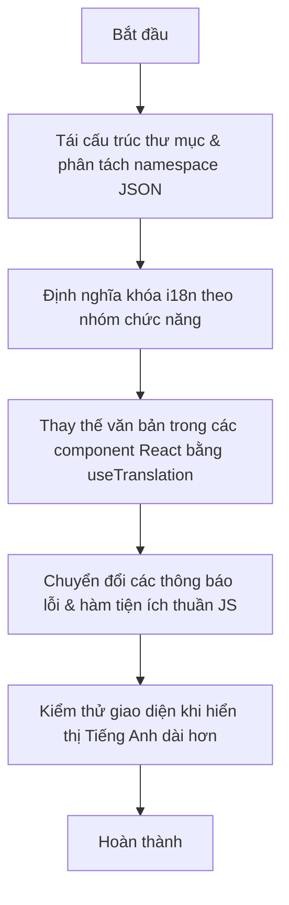

# Kế hoạch Di cư Quốc tế hóa (i18n Migration Plan) — Checkpoint Web

Dự án hiện có **488 chuỗi văn bản Tiếng Việt viết cứng** phân bổ trên **58 tệp tin** (đặc tả chi tiết tại [hardcoded_strings.md](file:///Users/quill/Workspace/Workspace/work-space/checkpoint/docs/hardcoded_strings.md)). 

Tài liệu này đề xuất kế hoạch chi tiết từng bước để chuyển đổi ứng dụng sang hỗ trợ đa ngôn ngữ (Tiếng Việt và Tiếng Anh) mà không làm ảnh hưởng đến luồng hoạt động hiện tại, tận dụng các thư viện `i18next` và `react-i18next` đã được cài đặt sẵn.

---

## 🏗️ 1. Hiện trạng Hạ tầng i18n
Ứng dụng đã có cấu hình i18n cơ bản tại [web/src/lib/i18n.ts](file:///Users/quill/Workspace/Workspace/work-space/checkpoint/web/src/lib/i18n.ts) và được nạp vào điểm khởi đầu của ứng dụng tại [web/src/main.tsx](file:///Users/quill/Workspace/Workspace/work-space/checkpoint/web/src/main.tsx).
* Thư viện sử dụng: `i18next`, `react-i18next` và `i18next-browser-languagedetector` (tự động lưu ngôn ngữ đã chọn vào `localStorage`).
* Ngôn ngữ mặc định: `vi` (Tiếng Việt).
* Đã cấu hình sơ bộ hai nhánh ngôn ngữ (`translation.bottomNav` và `translation.profile`).
* Dropdown chọn ngôn ngữ đã được tích hợp tại màn hình Cài đặt [SettingsSheet.tsx](file:///Users/quill/Workspace/Workspace/work-space/checkpoint/web/src/components/SettingsSheet.tsx).

---

## 📋 2. Kế hoạch Di cư Từng bước (Step-by-step Migration Plan)



### Bước 2.1: Phân tách tài nguyên ngôn ngữ thành các file JSON độc lập
Hiện tại, tài nguyên dịch đang được khai báo trực tiếp trong code tại [i18n.ts](file:///Users/quill/Workspace/Workspace/work-space/checkpoint/web/src/lib/i18n.ts). Khi quy mô chuỗi dịch tăng lên gần 500 chuỗi, việc gộp chung sẽ làm file cấu hình phình to và khó quản lý.
* **Hành động**: Chuyển các chuỗi dịch ra các file JSON tĩnh đặt trong thư mục `web/public/locales/`.
  * Tiếng Việt: `web/public/locales/vi/translation.json`
  * Tiếng Anh: `web/public/locales/en/translation.json`
* **Cấu hình i18n mới**: Cài đặt thêm `@import` hoặc sử dụng plugin `i18next-http-backend` để tải bất đồng bộ khi khởi chạy ứng dụng (giúp giảm dung lượng bundle tải về lần đầu).

### Bước 2.2: Định nghĩa khóa i18n chuẩn hóa theo nhóm (Namespaces)
Để tránh xung đột tên và dễ quản lý, toàn bộ 488 chuỗi cứng sẽ được phân cấp thành các nhóm chính sau trong file JSON:

| Nhóm (Namespace) | Phạm vi áp dụng | Ví dụ chuỗi gốc | Khóa đề xuất |
| :--- | :--- | :--- | :--- |
| `common` | Các nút, trạng thái, nhãn dùng chung | "Đóng", "Hủy", "Lưu", "Đang tải..." | `common.close`, `common.loading` |
| `auth` | Trang đăng nhập, đăng ký, lỗi xác thực | "Không tạo được phiên khách" | `auth.errors.guest_session_failed` |
| `map` | Các chỉ số bản đồ, định vị, xin quyền | "Cần HTTPS", "Bật vị trí" | `map.gps_required`, `map.permission_hint` |
| `checkpoint` | Form cắm cờ, chụp ảnh, camera, chi tiết cờ | "Cắm cờ tại đây", "Chụp lại" | `checkpoint.create.capture_again` |
| `discover` | Bản tin feed, kết quả tìm kiếm địa điểm | "đang theo dõi", "gần bạn" | `discover.feed.following_tab` |
| `journey` | Timeline hành trình, thống kê khoảng cách | "Không gắn hành trình", "Hành trình đang đi" | `journey.picker.none`, `journey.active` |
| `gamification` | Cấp độ, hộ chiếu, huy hiệu, bảng xếp hạng | "Con dấu tỉnh thành", "Bảng xếp hạng" | `game.passport.seals`, `game.leaderboard.title` |
| `notifications`| Chuông báo, mô tả thông báo | "đã bình luận bài viết của bạn" | `notification.type.comment` |

---

## 💻 3. Hướng dẫn Refactor Code (Code Modification Patterns)

### 3.1. Dịch chuỗi tĩnh trong JSX
Thay thế các đoạn text thuần bằng hàm `t(...)` từ React hook `useTranslation`.

**Trước:**
```tsx
// File: src/components/AvatarCropSheet.tsx
<Sheet title="Cắt ảnh đại diện" onClose={onClose}>
  <button>{processing ? "Đang xử lý..." : "Xong"}</button>
</Sheet>
```

**Sau:**
```tsx
import { useTranslation } from "react-i18next";

export function AvatarCropSheet({ onClose, processing }) {
  const { t } = useTranslation();
  return (
    <Sheet title={t("profile.avatar_crop.title")} onClose={onClose}>
      <button>{processing ? t("common.processing") : t("common.done")}</button>
    </Sheet>
  );
}
```

### 3.2. Dịch chuỗi chứa tham số động (Interpolation)
Sử dụng cú pháp gán tham số động của `i18next` thay vì dùng string template ES6 (`${value}`).

**Trước:**
```tsx
// File: src/components/BadgeUnlockModal.tsx
<span>Cấp {badge.level}</span>
```

**Sau:**
*   **JSON Dịch (`vi/translation.json`)**:
    ```json
    {
      "game": {
        "badge_level": "Cấp {{level}}"
      }
    }
    ```
*   **Code Component**:
    ```tsx
    <span>{t("game.badge_level", { level: badge.level })}</span>
    ```

### 3.3. Dịch các hàm thuần JS ngoài React (Helpers, API, Validation)
Đối với các file cấu hình hoặc helpers không phải React Component, chúng ta không dùng được hook. Thay vào đó, import thực thể `i18n` trực tiếp.

**Trước:**
```typescript
// File: src/auth/AuthContext.tsx
throw new Error("Không tạo được phiên khách");
```

**Sau:**
```typescript
import i18n from "../lib/i18n";

throw new Error(i18n.t("auth.errors.guest_session_failed"));
```

---

## 📂 4. Bản thảo Schema cấu trúc Dịch JSON (Translation Schema Skeleton)

Dưới đây là khung sườn mẫu của file JSON dịch dựa trên các chuỗi cứng đã quét được:

### `web/public/locales/vi/translation.json`
```json
{
  "common": {
    "loading": "Đang tải...",
    "processing": "Đang xử lý...",
    "done": "Xong",
    "close": "Đóng",
    "cancel": "Hủy bỏ",
    "save": "Lưu",
    "delete": "Xóa",
    "success": "Thành công",
    "retry": "Thử lại"
  },
  "auth": {
    "login": {
      "title": "Đăng nhập",
      "google_button": "Đăng nhập bằng Google",
      "guest_button": "Trải nghiệm với vai trò Khách",
      "email_placeholder": "Nhập địa chỉ email",
      "email_confirm_sent": "Kiểm tra email để xác nhận tài khoản, rồi đăng nhập."
    },
    "errors": {
      "guest_session_failed": "Không tạo được phiên khách"
    }
  },
  "checkpoint": {
    "create": {
      "title": "Cắm cờ",
      "place_name": "Tên địa điểm",
      "category": "Danh mục",
      "note": "Ghi chú",
      "rating": "Đánh giá",
      "upload_error": "Tải ảnh lên thất bại",
      "no_camera": "Không mở được camera. Hãy chọn ảnh từ thư viện.",
      "gallery_button": "Chọn từ thư viện",
      "capture_again": "Chụp lại",
      "continue": "Tiếp tục"
    },
    "detail": {
      "title": "Chi tiết cắm cờ",
      "taken_at": "Chụp lúc {{time}}",
      "delete_confirm": "Xoá check-in này?",
      "delete_button": "Xoá check-in"
    }
  },
  "game": {
    "passport": {
      "title": "Hộ chiếu",
      "seals_count": "Đã thu thập {{count}} con dấu"
    },
    "leaderboard": {
      "title": "Bảng xếp hạng",
      "my_rank": "Hạng của tôi: {{rank}}"
    }
  }
}
```

### `web/public/locales/en/translation.json`
```json
{
  "common": {
    "loading": "Loading...",
    "processing": "Processing...",
    "done": "Done",
    "close": "Close",
    "cancel": "Cancel",
    "save": "Save",
    "delete": "Delete",
    "success": "Success",
    "retry": "Retry"
  },
  "auth": {
    "login": {
      "title": "Log In",
      "google_button": "Log in with Google",
      "guest_button": "Continue as Guest",
      "email_placeholder": "Enter your email",
      "email_confirm_sent": "Check your email to verify your account, then log in."
    },
    "errors": {
      "guest_session_failed": "Failed to create guest session"
    }
  },
  "checkpoint": {
    "create": {
      "title": "Check-in",
      "place_name": "Place name",
      "category": "Category",
      "note": "Notes",
      "rating": "Rating",
      "upload_error": "Upload failed",
      "no_camera": "Could not access camera. Please pick from library.",
      "gallery_button": "Choose from library",
      "capture_again": "Retake",
      "continue": "Continue"
    },
    "detail": {
      "title": "Check-in Detail",
      "taken_at": "Taken at {{time}}",
      "delete_confirm": "Delete?",
      "delete_button": "Delete"
    }
  },
  "game": {
    "passport": {
      "title": "Passport",
      "seals_count": "Collected {{count}} seals"
    },
    "leaderboard": {
      "title": "Leaderboard",
      "my_rank": "My rank: {{rank}}"
    }
  }
}
```

---

## ⚠️ 5. Các điểm lưu ý quan trọng (Gotchas & Best Practices)

1.  **Vỡ giao diện (Layout Clipping/Truncation)**: Tiếng Anh hoặc các ngôn ngữ khác thường dài hơn Tiếng Việt từ 15-30% ở các nhãn ngắn. Cần kiểm tra kỹ các khối Flexbox/Grid và các thuộc tính CSS như `truncate`, `w-fit`, `min-w-0` để đảm bảo nút hoặc thẻ không bị ẩn mất chữ hoặc lệch dòng khi đổi sang Tiếng Anh (ví dụ: *"Cắm cờ"* → *"Check-in"*, *"Khoảnh khắc"* → *"Moments"*).
2.  **Định dạng ngày tháng và khoảng cách**: Các hàm `toLocaleString("vi-VN")` viết cứng (ví dụ: ở `CheckpointDetailSheet.tsx` dòng 130) cần được chuyển sang định dạng linh hoạt dựa trên ngôn ngữ hiện tại của ứng dụng:
    ```typescript
    new Date(data.checkpoint.taken_at).toLocaleString(i18n.language)
    ```
    Khoảng cách (m/km) nên được viết hàm bao để đổi chuẩn tùy theo locale (mặc dù hiện tại cả VN/EN đều dùng km/m).
3.  **Tên địa điểm từ APIs (Photon/LocationIQ)**: Tên địa điểm cắm cờ do người dùng tạo hoặc load từ các API địa chính bên ngoài thường chỉ có Tiếng Việt. Đây là dữ liệu động do người dùng (User-Generated Content) nên không cần quản lý qua bộ dịch tĩnh i18n mà hiển thị thô trực tiếp.
